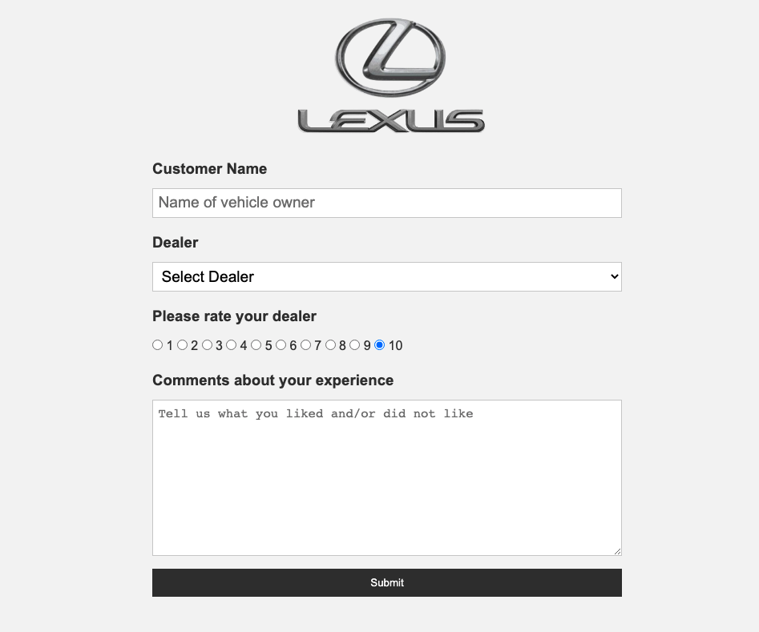
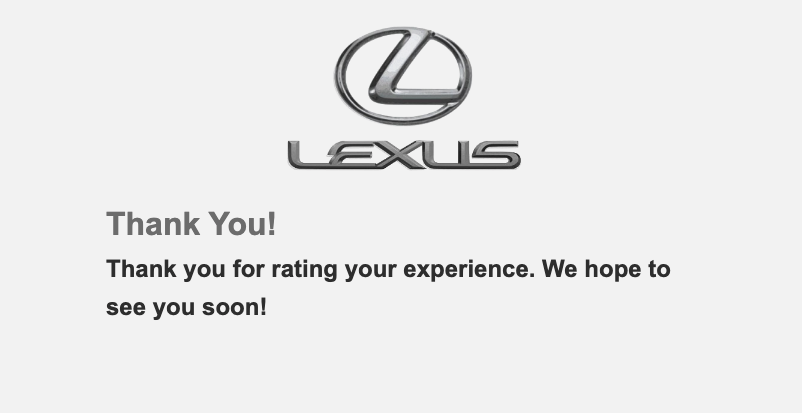
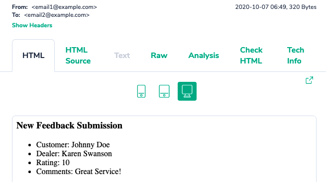
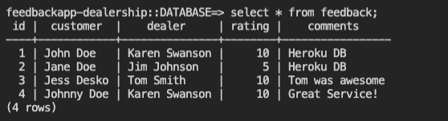

This application allows customers to provide feedback to car dealerships about their experience via an online form. The feedback consists of the customer's name, name of the dealership rep, rating (1-10), and comments. The feedback is stored in a database following submission and sends an email notification with the feedback information.

Feedback is stored in a production PostgreSQL database
Notifications of new feedback are sent to email inbox
Application stops customers from creating duplicate entries
Application ensures that customer name and dealer name are not empty
"Thank you" submission screen is rendered after submitting form

- Python
- HTML
- CSS
- Mailtrap.io
- Heroku
- Local PostgreSQL development db
- Heroku PostgreSQL addon production db

Updated: 10/2020
